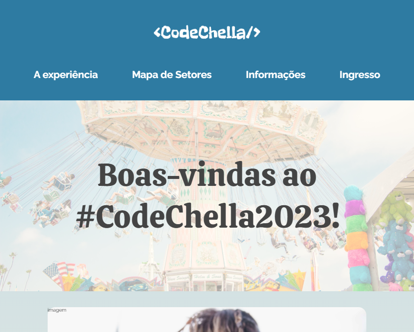
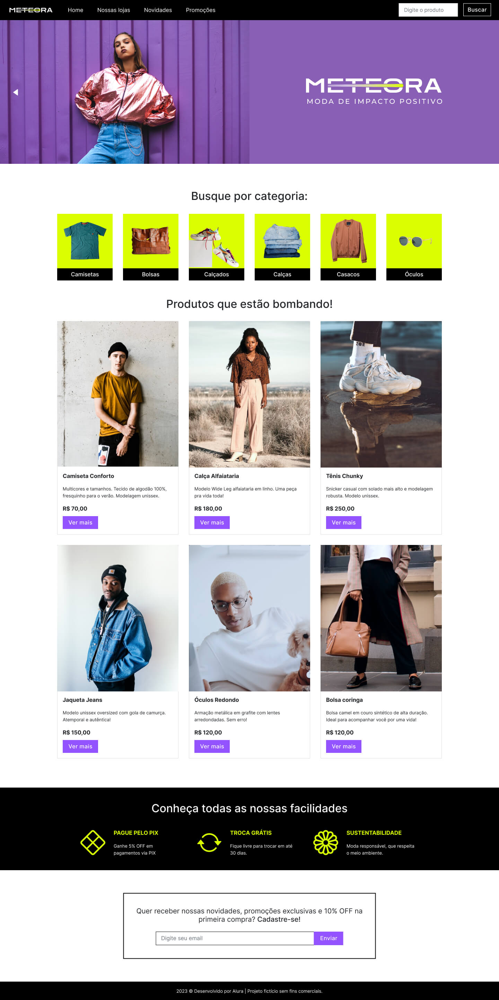

  

---

## 📌 Sobre
O Alura Challenges é um projeto destinado para todos os alunos e alunas da Alura que querem colocar em prática tudo o que estão aprendendo. Para assim, sair da teoria para uma experiência real, seguindo os moldes de solicitação, execução e entrega de um projeto para as empresas que você irá trabalhar no futuro.

## 🚀 Challenges
Somos desafiados a desenvolver uma aplicação em um período de quatro semanas. A cada semana nos são disponibilizados cards no Trello com as tarefas que deverão ser cumpridas.

### Front-end:

  ✔️ concluído &nbsp;&nbsp;&nbsp;|&nbsp;&nbsp;&nbsp;
  🔵 em desenvolvimento &nbsp;&nbsp;&nbsp;|&nbsp;&nbsp;&nbsp;
  ⚫ não iniciado 

---

| Edição | Tipo do projeto | Repositório | Link | Status | Preview
| --- | --- | --- | --- | --- | --- |
| 5 | E-Commerce | [Alura Geek](./alura-geek/) | [Link](https://alura-geek-challenge.vercel.app/) | ✔️ |  |
| 6 | Site Divulgação | [CodeChella](./codechella/) | [Link](https://codechella-two.vercel.app/) | ✔️ |  |
| 7 | E-Commerce | [Meteora](./meteora/) | - | 🔵 |  |