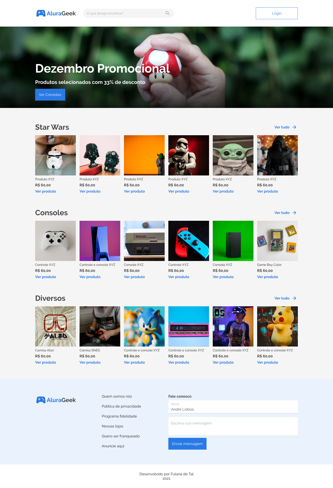

  

---

  <a href="https://alura-geek-challenge.vercel.app/">Link</a> &nbsp;&nbsp;&nbsp;|&nbsp;&nbsp;&nbsp;
  <a href="#-sobre">Sobre</a> &nbsp;&nbsp;&nbsp;|&nbsp;&nbsp;&nbsp;
  <a href="#-challenge">Challenge</a> &nbsp;&nbsp;&nbsp;|&nbsp;&nbsp;&nbsp;
  <a href="#-tecnologias">Tecnologias</a> &nbsp;&nbsp;&nbsp;|&nbsp;&nbsp;&nbsp;
  <a href="#-sprints">Sprints</a> &nbsp;&nbsp;&nbsp;|&nbsp;&nbsp;&nbsp;
  <a href="#-preview">Preview</a> 

--- 

## 📌 Sobre
A empresa **AluraGeek** está precisando trazer mais clientes e aumentar suas vendas, para isso desejam implementar um e-commerce e levar a empresa ao próximo patamar, se tornar mais digital.

---

## 🚀 Challenge 
O site e o e-commerce deve conter os seguintes requisitos:

  🔹 Uma página inicial que contenha um botão "iniciar sessão" e um buscador de produtos oferecidos pela empresa.

  🔹 Um banner que contenha descontos, promoções, ou informações relevantes do momento.

  🔹 Uma galeria com as informações dos produtos como: a imagem, o nome do produto, o preço e um link que leva até a página de descrição do produto.

  🔹 Uma página do produto que contenha a imagem, o nome, a descrição e o preço.

  🔹 Um rodapé com formulário para contato e outras informações relevantes.

  🔹 Menu administrador para eles conseguirem adicionar, editar, buscar ou eliminar produtos da loja.

  🔹 É muito importante que o site seja responsivo para dar aos clientes a facilidade de comprar através de dispositivos mobiles.
</ul>

---

## 🔨 Tecnologias
As ferramentas e tecnologias eram de livre escolha. Eu escolhi desenvolver o projeto com:

<ul>
  <li>Next.js</li>
  <li>Styled-Components</li>
</ul>

---

## 🏃 Sprints
A cada semana do **Alura Challenges** nos foram disponibilizados um quadro no Trello para gerenciar o desenvolvimento do projeto.

  ✔️ concluído &nbsp;&nbsp;&nbsp;|&nbsp;&nbsp;&nbsp;
  🔵 em desenvolvimento &nbsp;&nbsp;&nbsp;|&nbsp;&nbsp;&nbsp;
  ⚫ não iniciado 

| Semana | Sprint | Trello |Status |
| --- | --- | --- | --- |
| 01 | Criando minha loja: interface cliente | [link](https://trello.com/b/YahtquUC/challenge-front-end-semana-1) | 🔵 |
| 02 | ➖ | ➖ | ⚫ |
| 03 | ➖ | ➖ | ⚫ |
| 04 | ➖ | ➖ | ⚫ |

--- 

## 🎮 Preview

  

