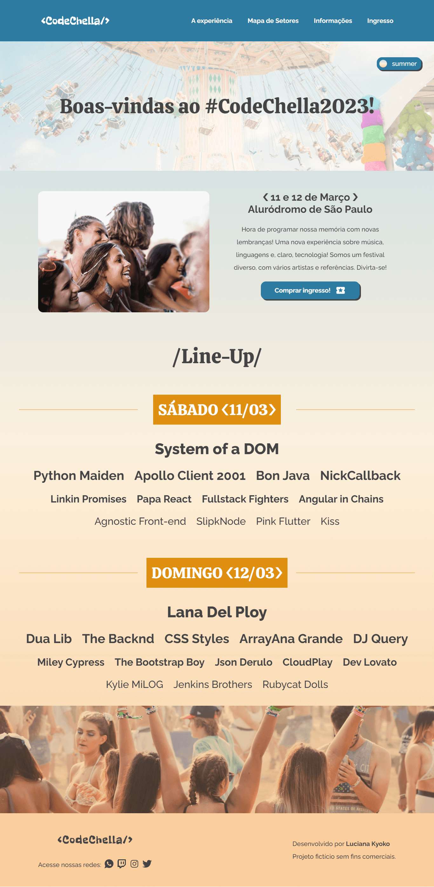

  

---

  <a href="https://codechella-two.vercel.app/">Link</a> &nbsp;&nbsp;&nbsp;|&nbsp;&nbsp;&nbsp;
  <a href="#-sobre">Sobre</a> &nbsp;&nbsp;&nbsp;|&nbsp;&nbsp;&nbsp;
  <a href="#-challenge">Challenge</a> &nbsp;&nbsp;&nbsp;|&nbsp;&nbsp;&nbsp;
  <a href="#-tecnologias">Tecnologias</a> &nbsp;&nbsp;&nbsp;|&nbsp;&nbsp;&nbsp;
  <a href="#-sprints">Sprints</a> &nbsp;&nbsp;&nbsp;|&nbsp;&nbsp;&nbsp;
  <a href="#-indo-alem">Indo além</a> &nbsp;&nbsp;&nbsp;|&nbsp;&nbsp;&nbsp;
  <a href="#-preview">Preview</a> 

---

## 📌 Sobre
O **CodeChella** é um festival (fictício) de música alternativa que acontece anualmente, é composto por gêneros diversos e visa promover uma experiência encantadora e inesquecível para o visitante, proporcionando uma integração multicultural e social. 

Com a intenção de divulgar o evento e vender ingressos, o festival deseja implementar um site que possibilite essas ações.

---

## 🚀 Challenge 
A página do **CodeChellas** deve seguir os seguintes requisitos:

| check | Requisitos: |
| - | - |
| ✔️ | Uma página inicial que mostrará as atrações do festival |
| ✔️ | Uma página para explicar a experiência do festival, mostrando os diversos palcos |
| ✔️ | Uma página para demonstrar os setores disponíveis para compra de ingresso |
| ✔️ | Uma página de perguntas frequentes |
| ✔️ | Uma página para compra de ingressos através do preenchimento do formulário |
| ✔️ | Uma página para mostrar o ingresso gerado |
| ✔️ | É muito importante que o site seja responsivo para dar aos clientes a facilidade de comprar através de dispositivos mobiles |
| ✔️ | Layout base desenvolvido pela designer: [Figma](https://www.figma.com/file/xHLPBeA2ujaXbBjHMK9xh7/CodeChella-%7C-Challenge-I---Front-end-2023?node-id=)  |

---

## 🔨 Tecnologias
As ferramentas e tecnologias eram de livre escolha. Eu escolhi desenvolver o projeto com:
<ul>
  <li>React</li>
  <li>Next.js</li>
  <li>Styled-components</li>
  <li>MongoDB</li>
  <li>mongoose</li>
  <li>react-icons</li>
  <li>html2canvas</li>
  <li>react-confetti</li>
</ul>

---

## 🏃 Sprints
A cada semana do **Alura Challenges** nos foram disponibilizados um quadro no Trello para gerenciar o desenvolvimento do projeto.

  ✔️ concluído &nbsp;&nbsp;&nbsp;|&nbsp;&nbsp;&nbsp;
  🔵 em desenvolvimento &nbsp;&nbsp;&nbsp;|&nbsp;&nbsp;&nbsp;
  ⚫ não iniciado 

| Semana | Sprint | Trello |Status |
| --- | --- | --- | --- |
| 1 | Conheça o CodeChella | [Backlogs - Semana 01](https://trello.com/b/wakg1ft4/codechella-semana-1) | ✔️ |
| 2 | Expandindo o festival | [Backlogs - Semana 02](https://trello.com/b/sNWh1Ggl/codechella-semana-2) | ✔️ |
| 3 | Inscrições e Ingressos | [Backlogs - Semana 03](https://trello.com/b/NnQIEPIw/codechella-semana-3-e-4) | ✔️ |
| 4 | Inscrições e Ingressos | [Backlogs - Semana 03](https://trello.com/b/NnQIEPIw/codechella-semana-3-e-4) | ✔️ |

---

## 🚩 Indo alem
  -> Neste challenge era possível escolher um tema dentre os dois disponíveis (summer ou boreal). Eu optei por desenvolver com os dois temas e permitir que o usuário realizasse a troca de acordo com suas preferências.

  -> Criação do botão que realiza o "scroll" para o topo da página.

  - efeito paralaxe simples no banner de todas as páginas.

  -> O formulário para gerar o ticket conta com:
    - 3 etapas (dados pessoais, informações do evento e confirmação)
    - um popup é exibido na tela quando o preenchimento do formulário não for satisfatório
    - um componente que mostra a etapa de acordo com o preenchimento do formulário
    - mapa interativo. O usuário poderá escolher o setor desejado apenas clicando no mapa
    - loding de carregamento. Este componente é ativado enquanto os dados estão sendo salvos no banco de dados
    - redirecionamento automático para a página que mostra o ingresso. 
    - Efeito de confete é disparado assim o ingresso é exibido.
    - Possibilidade do usuário realizar o download do ingresso.
  
---

## 🎯 Preview

  

